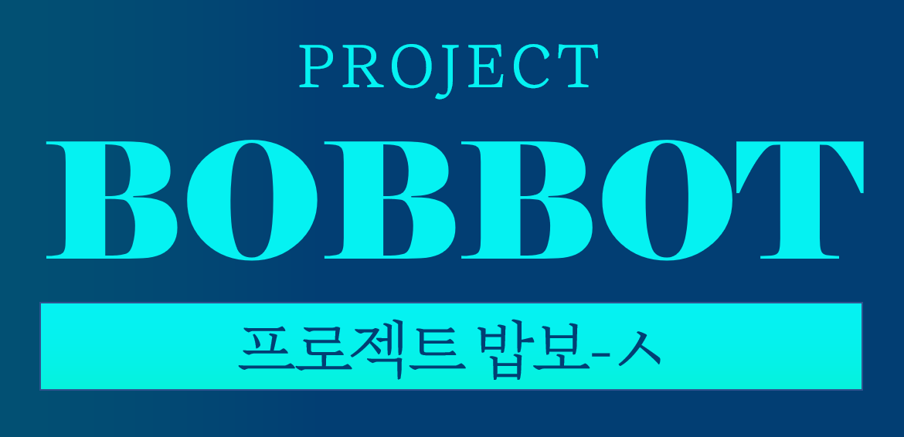

## 1. 프로젝트 개요
  다이닝코드</a>(DiningCode)' 홈페이지에서 검색한 결과를 크롤링(Crawling)을 통해 가져와 보여주는 '텔레그램(Telegram)' 봇(Bot)입니다.
  현재 텔레그램에서 <span style="color: #FFD700">@BobAutoBot</span>을 검색해 대화를 시작하면, 밥보-ㅅ을 체험해 볼 수 있습니다.

---

## 2. 의존성(Dependency) 정보


---

## 3. 설치 및 실행 방법

① 전체 패키지를 다운로드 받습니다.

```bash
git clone https://github.com/sesac-finance/Crassula_Package.git
```

② Crassula_Package 폴더로 이동합니다.

```bash
cd Crassula_Package
```

③ requirements.txt를 이용해 필요한 라이브러리를 설치합니다.


```bash
pip install -r requirements.txt
```

④ ProjectBobbot 폴더로 이동합니다.


```bash
cd ProjectBobbot
```

⑤ telegram_config 파일을 만들고 첫째 줄에 "token = [텔레그램에서 발급 받은 봇 토큰]"을 입력 후 저장합니다.

⑥ 채팅 로그를 저장할 ChatLog 폴더를 생성합니다.

```bash
mkdir Chatlog
```

⑦ Bobbot.py 파일을 실행합니다.


```bash
python Bobbot.py
```

---

## 4. 패키지 구조

<p></p>
